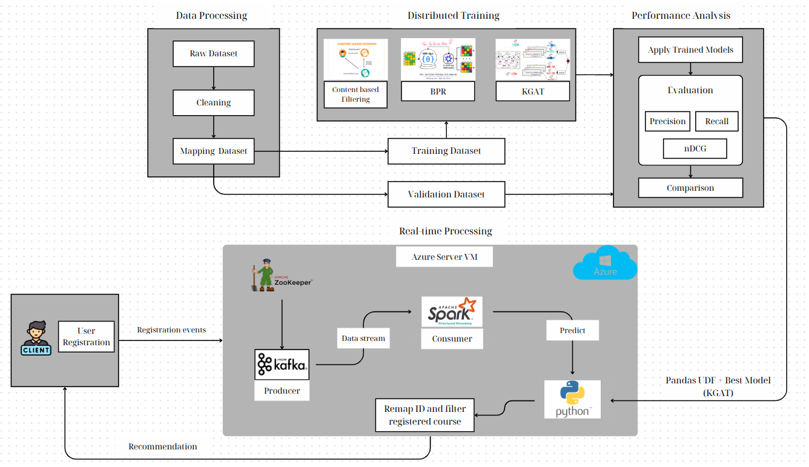

# Course Recommendation

This project implements a personalized course recommendation system using collaborative filtering and knowledge graph techniques. It includes two main models (KGAT and BPRMF) for recommendation tasks and simulates real-time data ingestion using Kafka.

## **System Pipeline Overview**


Below are the steps to train the models, set up streaming data, and visualize the end-to-end pipeline.

## **Model Training**
* **KGAT**
```bash
!python /kaggle/working/KGAT-pytorch/main_kgat.py \
                    --data_dir "/kaggle/input" \
                    --data_name course-recommendation \
                    --use_pretrain 0 \
                    --n_epoch 45 \
                    --cf_batch_size 1024 \
                    --kg_batch_size 2048 \
                    --test_batch_size 256 \
                    --cf_print_every 50 \
                    --kg_print_every 50 \
                    --evaluate_every 5 \
                    --Ks '[20,40,60,80,100]'
```
* **BPRMF**
```bash
!python /kaggle/working/KGAT-pytorch/main_bprmf.py \
                    --data_dir "/kaggle/input" \
                    --data_name course-recommendation \
                    --use_pretrain 0 \
                    --lr 0.0005 \
                    --print_every 1433 \
                    --evaluate_every 5 \
                    --Ks '[20,40,60,80,100]'
```

## **Real-Time Streaming with Kafka**
* Start Zoo-keeper: 
```bash
bin/zookeeper-server-start.sh config/zookeeper.properties
```
* Start Kafka-server: 
```bash
export KAFKA_HEAP_OPTS="-Xmx256M -Xms128M"
bin/kafka-server-start.sh config/server.properties
```
* Create a topic to send/receive messages:
```bash
bin/kafka-topics.sh --create --topic test1 --bootstrap-server {localhost/Put the Public IP of your EC2 Instance:9092} --replication-factor 1 --partitions 1
```
* Run the Kafka consumer to listen for incoming data: 
```bash
python3 kafka_consumer.py
```
Make sure the consumer is fully started and ready to receive messages before running the producer.
* Run the Kafka producer to send data to the topic: 
```bash
python3 kafka_producer.py
```
Only do this after the consumer is ready to ensure no messages are missed.
